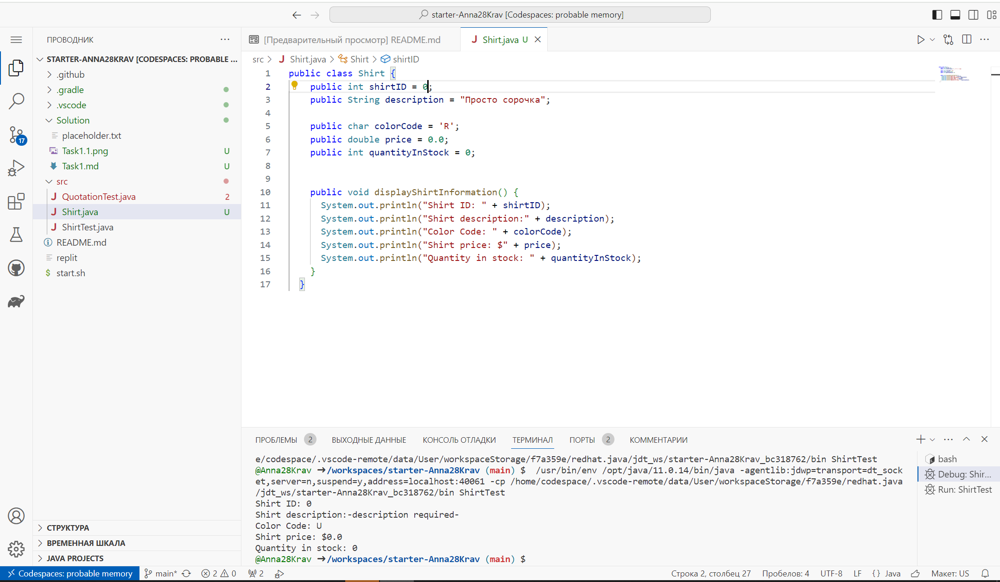
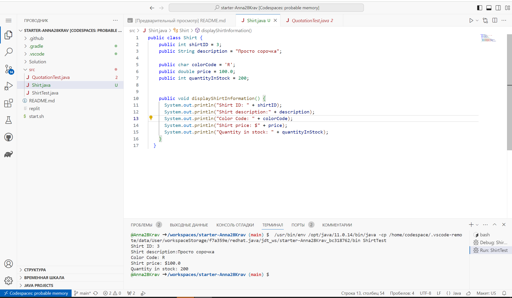

# Завдання 1



````java
public class Shirt {
    public int shirtID = 0;
    public String description = "Просто сорочка";
    
    public char colorCode = 'R';
    public double price = 0.0;
    public int quantityInStock = 0;
    

    public void displayShirtInformation() {
      System.out.println("Shirt ID: " + shirtID);
      System.out.println("Shirt description:" + description);
      System.out.println("Color Code: " + colorCode);
      System.out.println("Shirt price: $" + price);
      System.out.println("Quantity in stock: " + quantityInStock);
    }
  }
````




````java
public class Shirt {
    public int shirtID = 3;
    public String description = "Просто сорочка";
    
    public char colorCode = 'R';
    public double price = 100.0;
    public int quantityInStock = 200;
    

    public void displayShirtInformation() {
      System.out.println("Shirt ID: " + shirtID);
      System.out.println("Shirt description:" + description);
      System.out.println("Color Code: " + colorCode);
      System.out.println("Shirt price: $" + price);
      System.out.println("Quantity in stock: " + quantityInStock);
    }
  }
````